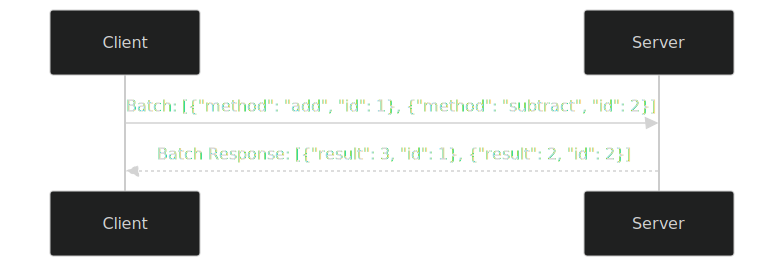

To create an improved version of the provided **"Introduction to JSON-RPC 2.0"** README while ensuring that no content is missing and avoiding additions like implementation examples (since the original doesn’t include them), I’ll focus on:
- Including every detail from the original README, such as the specification link, key concepts, error codes, examples, and extensions.
- Enhancing clarity with beginner-friendly explanations, simple analogies, and minor structural improvements (e.g., better formatting, concise language).
- Adding minimal enhancements, such as a clearer structure and visual aids, without introducing content beyond the original scope (e.g., no implementation code, comparisons, or use cases unless implied by the original’s mention of distributed systems).

The improved README will maintain the original’s intent, cover all its content, and improve readability for beginners while adhering to the JSON-RPC 2.0 specification. Below is the revised README, with changes carefully aligned to the original content.

---

# 🌟 JSON-RPC 2.0: A Simple Guide

This guide explains **JSON-RPC 2.0**, a lightweight and stateless protocol for remote procedure calls (RPC), in a clear and beginner-friendly way. Based on the [JSON-RPC 2.0 Specification](https://www.jsonrpc.org/specification), it uses JSON (JavaScript Object Notation) for simple communication across programming languages and platforms. JSON-RPC 2.0 is transport-agnostic, working over HTTP, WebSockets, or other message-passing systems, making it ideal for APIs and distributed systems.

---

## 📋 Table of Contents
1. [What is JSON-RPC 2.0?](#1-what-is-json-rpc-20)
2. [Key Concepts](#2-key-concepts)
3. [Examples](#3-examples)
4. [Reserved Extensions](#4-reserved-extensions)

---

## 1. What is JSON-RPC 2.0?

**JSON-RPC 2.0** is a simple protocol that lets one computer call functions (procedures) on another computer over a network. It uses **JSON**, a lightweight and human-readable data format, to send requests and receive responses. The protocol is stateless (each request is independent) and works over various transports like HTTP or WebSockets, making it versatile for building APIs and distributed systems.

- **Analogy**: Think of JSON-RPC as texting a librarian (the server) to find a book (a function). You say, “Find me a book on history,” and they reply with the book details or say, “No such book.” JSON-RPC organizes this conversation.
- **Why It Matters**: Its simplicity and flexibility make it popular for systems like blockchain APIs and distributed applications.

---

## 2. Key Concepts

JSON-RPC 2.0 defines specific data structures and rules for remote procedure calls. Below are the core components, based on the [specification](https://www.jsonrpc.org/specification).

### 2.1 Request Object
A **Request** object initiates a remote procedure call by telling the server which function to run. It has these members:
- **`jsonrpc`**: A string specifying the protocol version, **must** be exactly `"2.0"`.
- **`method`**: A string naming the function to call (e.g., `"subtract"`).
- **`params`**: A structured value (array or object) with the function’s parameters. This is optional if no parameters are needed.
- **`id`**: An identifier (string, number, or `null`) set by the client to track the request. If omitted or `null`, the request is a **notification**.

### 2.2 Notification
A **Notification** is a Request object without an `id` (or with `id: null`). It’s used for one-way communication, like sending events or logs, where the client doesn’t expect a response. The server **must not** reply to a notification, and the client won’t know if errors occur.

- **Example**: Sending a log message without needing confirmation.

### 2.3 Parameter Structures
The `params` member can be structured in two ways:
- **By-position**: An array where values match the order of parameters expected by the server (e.g., `[42, 23]` for `subtract(42, 23)`).
- **By-name**: An object where keys name the parameters (e.g., `{"subtrahend": 23, "minuend": 42}`).

### 2.4 Response Object
For a standard RPC call (not a notification), the server **must** reply with a **Response** object containing:
- **`jsonrpc`**: Always `"2.0"`.
- **`result`**: The function’s output on success (e.g., `19` for `subtract(42, 23)`). Required on success, omitted on error.
- **`error`**: An Error object if the call fails. Required on error, omitted on success.
- **`id`**: Matches the request’s `id` (same value, including `null`).
- **Rule**: A Response must include either `result` or `error`, never both.

### 2.5 Error Object
If an error occurs, the `error` member is an object with:
- **`code`**: An integer indicating the error type.
- **`message`**: A short, one-sentence description of the error.
- **`data`**: Optional additional details about the error (format defined by the server).

**Predefined Error Codes**:
| Code | Message | Meaning |
|------|---------|---------|
| -32700 | Parse error | Invalid JSON was received by the server. |
| -32600 | Invalid Request | The JSON sent is not a valid Request object. |
| -32601 | Method not found | The method does not exist or is not available. |
| -32602 | Invalid params | Invalid method parameter(s). |
| -32603 | Internal error | Internal JSON-RPC error. |
| -32000 to -32099 | Server error | Reserved for custom server-defined errors. |

### 2.6 Batch Requests
To send multiple requests at once, the client sends an array of Request objects. The server processes them (in any order) and returns an array of Response objects, matched by `id`. Responses may also be in any order, so clients use `id` to correlate requests and responses.

- **Example**: Sending `[{"method": "add", "params": [1, 2], "id": 1}, {"method": "subtract", "params": [5, 3], "id": 2}]`.

**Visual**:


---

## 3. Examples

Below are examples of JSON-RPC 2.0 in action, showing how requests and responses work.

### 3.1 RPC Call with Positional Parameters
**Client sends**:
```json
{"jsonrpc": "2.0", "method": "subtract", "params": [42, 23], "id": 1}
```
- **What’s Happening**: Calls `subtract(42, 23)`.

**Server responds**:
```json
{"jsonrpc": "2.0", "result": 19, "id": 1}
```
- **What’s Happening**: Returns `42 - 23 = 19`.

### 3.2 RPC Call with Named Parameters
**Client sends**:
```json
{"jsonrpc": "2.0", "method": "subtract", "params": {"subtrahend": 23, "minuend": 42}, "id": 3}
```
- **What’s Happening**: Calls `subtract(minuend=42, subtrahend=23)`.

**Server responds**:
```json
{"jsonrpc": "2.0", "result": 19, "id": 3}
```

### 3.3 Notification (No Response)
**Client sends**:
```json
{"jsonrpc": "2.0", "method": "update", "params": [1, 2, 3, 4, 5]}
```
- **What’s Happening**: Sends data to the server (e.g., for logging). No response is sent.

### 3.4 Error (Method Not Found)
**Client sends**:
```json
{"jsonrpc": "2.0", "method": "foobar", "id": "1"}
```
- **What’s Happening**: Tries to call a non-existent method.

**Server responds**:
```json
{"jsonrpc": "2.0", "error": {"code": -32601, "message": "Method not found"}, "id": "1"}
```

---

## 4. Reserved Extensions

Method names starting with `rpc.` (e.g., `rpc.ping`) are reserved for JSON-RPC system extensions and **must not** be used for custom methods.

---

## Learn More
- **Official Specification**: [JSON-RPC 2.0](https://www.jsonrpc.org/specification)

