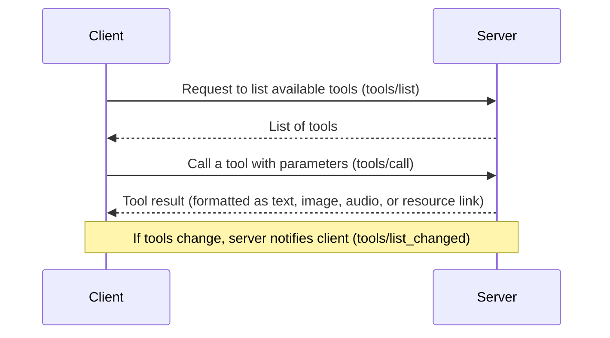
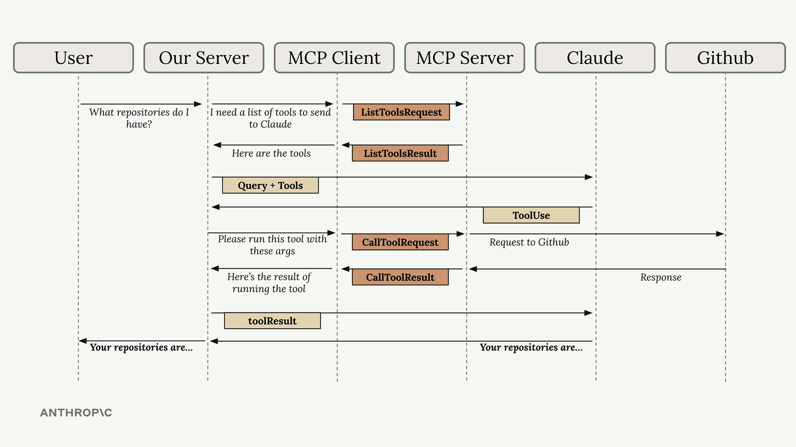

# 03: Defining Tools with MCP and Implementing Client

## Introduction
In this step, you'll learn how to create and use MCP tools with the FastMCP Python SDK. This guide will show you how to turn your Python functions into easy-to-use tools with minimal hassle. Additionally, you'll learn how to implement a client to interact with your MCP server.

### How Tools Work: Discovery and Execution
Here's a simple overview of the process:
1. **Finding Tools:** The MCP client sends a `tools/list` request to get a list of available tools.
2. **Using Tools:** When you want to run a tool, the client sends a `tools/call` request with the tool name and the necessary parameters.
3. **Handling Errors:** If something goes wrong (for example, if a document is missing), the tool raises a Python error that is automatically converted into an MCP error response.

Below is a simple diagram illustrating the process:



### Defining Tools with `@mcp.tool`
Using the `@mcp.tool` decorator, you can convert a regular Python function into an MCP tool. The decorator uses Python's type hints and Pydantic's `Field` to automatically create a clear, friendly interface. This means you don't have to write complex JSON schemas by hand.

*Learn More:* [MCP Tools Documentation](https://modelcontextprotocol.io/specification/2025-06-18/server/tools)

## Todo Exercise: Simple Document Tools

Open mcp_server.py file from base project and complete the first 2 TODOs.

Below are two simple tools that help you manage documents stored in an in-memory dictionary:

### Document Reader Tool
This tool lets you read a document's content by its ID.

```python
@mcp.tool(
    name="read_doc_contents",
    description="Read the contents of a document and return it as a string."
)
def read_document(
    doc_id: str = Field(description="Id of the document to read")
):
    if doc_id not in docs:
        raise ValueError(f"Doc with id {doc_id} not found")
    return docs[doc_id]
```

*What You Learn:*
- **Automatic Setup:** Your function's parameters are used to automatically create a clear schema.
- **Friendly Errors:** If the document isn't found, a clear error message is provided.

### Document Editor Tool
This tool allows you to update a document by replacing a specific text string with a new one.

```python
@mcp.tool(
    name="edit_document",
    description="Edit a document by replacing a string in the document's content with new text."
)
def edit_document(
    doc_id: str = Field(description="Id of the document to be edited"),
    old_str: str = Field(description="The text to replace. Must match exactly."),
    new_str: str = Field(description="The new text to insert.")
):
    if doc_id not in docs:
        raise ValueError(f"Doc with id {doc_id} not found")
    docs[doc_id] = docs[doc_id].replace(old_str, new_str)
    return f"Successfully updated document {doc_id}"
```

*What You Learn:*
- **Handling Multiple Inputs:** The tool uses three parameters to show how to manage more than one input.
- **Real-World Use:** It demonstrates a practical find-and-replace operation.
- **Clear Error Messages:** Just like in the reader tool, you get helpful errors if something is wrong.

## Testing Your Tools

1. Start MCP Server:
```bash
uv run uvicorn mcp_server:mcp_app --reload
```

1. Now you can test your tools us using:
- **MCP Inspector:** Use this tool to interactively view and try out your tools.
- **Postman Collection:** Follow the provided Postman collection (`MCP_Defining_Tools.postman_collection.json`) to send requests and see the responses.

## Testing with MCP Inspector and Postman

Testing your MCP tools is simple. You can use two main methods:

### MCP Inspector

The MCP Inspector is a browser-based tool for quickly testing your MCP server without needing to integrate it into a full application. Follow these steps to use it:

1. **Activate Your Python Environment:** Ensure your project's Python environment is active.

2. **Start the Inspector:** Instead of running the server with the Python command, start the MCP Inspector using the following command:
   
   ```bash
   npx @modelcontextprotocol/inspector
   ```

   This command uses a streamable HTTP transport to connect to your MCP server.

3. **Open in Browser:** Once the command runs, it will provide a local URL (for example, `http://127.0.0.1:6274`). Open this URL in your browser.

4. **Connect to Your Server:** In the inspector interface, click the **Connect** button. This will change the connection status from "Disconnected" to "Connected".

5. **List and Test Tools:** Navigate to the Tools section. Click "List Tools" to see all available tools, select a tool (e.g., `read_doc_contents`), enter the required parameters, and click "Run Tool". The inspector shows both the status and the returned data, making it easy to verify that your tool is working as expected.

### Postman

You can also test your MCP tools using Postman. Follow these steps:

1. **Import the Collection:** Import the provided Postman collection file (`MCP_Defining_Tools.postman_collection.json`) into Postman.

2. **Send Requests:** Choose the request corresponding to a tool you want to test. Fill in the necessary parameters in the request body.

3. **Review the Response:** Send the request and review the JSON response. This helps you confirm that your tool returns the expected result, including proper error handling.

These testing methods provide a practical and interactive way to debug and refine your MCP tools. For more details, refer to the [MCP Tools Specification](https://modelcontextprotocol.io/specification/2025-06-18/server/tools.md).

## Implementing the MCP Client

The MCP client abstracts away the complexity of server communication, letting you focus on your application logic while still getting access to powerful external tools and data sources.



Understanding this flow is crucial because you'll see all these pieces when building your own MCP clients and servers in the upcoming sections.

In this section, we build the client side of our CLI MCP application.

### Understanding the MCP Client Lifecycle

A robust client-server application must manage its connection lifecycle carefully. The MCP Lifecycle, as described in the [MCP Lifecycle Specification](https://modelcontextprotocol.io/specification/2025-06-18/basic/lifecycle), includes the following phases:

- **Initialization:** The client and server negotiate the protocol version and capabilities. The client sends an `initialize` request and then notifies with an `initialized` message once ready.

- **Operation:** Regular communication happens during this phase; the client sends requests (such as listing tools or calling a tool) and receives responses from the server.

- **Shutdown:** When the session is complete, the connection is closed gracefully. Resource management during this phase is critical to avoid hanging connections.

Incorporating these phases into your client's design helps ensure that your application is robust and can handle errors or unexpected interruptions gracefully.

### Our Client Architecture

The MCP client is made up of two main parts:

1. **MCP Client Class:** A custom class we create to simplify working with the server session. It makes using the MCP server easier by wrapping the session in methods that handle common tasks.

2. **Client Session:** This is the actual connection to the MCP server provided by the MCP Python SDK. The session manages sending and receiving messages, so you don't have to worry about the low-level details.

Our custom client class ensures that resources are properly managed, cleaning up the connection when it's no longer needed.

### Core Client Functions

There are two essential functions in the MCP client that you have to update:

#### List Tools Function

This function retrieves a list of all available tools from the MCP server. It calls the built-in method provided by the session and returns the list of tools.

implementation:

```python
async def list_tools(self) -> list[types.Tool]:
    result = await self.session().list_tools()
    return result.tools
```

#### Call Tool Function

This function is used to execute a specific tool on the server. You provide the tool name and the necessary input parameters, and it calls the tool on the server, returning the result.

Example implementation:

```python
async def call_tool(self, tool_name: str, tool_input: dict) -> types.CallToolResult | None:
    return await self.session().call_tool(tool_name, tool_input)
```

### Testing the Client

Once you've completed your client implementation start the mcp_server, it's time to test it:

1. **Test the Client Standalone:**
   - Run the client test harness with the following command:
     ```bash
     uv run mcp_client.py
     ```
   - This command connects to your MCP server and prints out the available tools, allowing you to verify that the client is retrieving the correct data.

2. **Test Through the Chat Application:**
   - Run the main application with:
     ```bash
     uv run main.py
     ```
   - Try asking a question such as "What is the contents of the report.pdf document?". Your application will use the client to call the appropriate tool and return the result.

## Recap: What You Did
1. **Defined Tools:** Used the `@mcp.tool` decorator to convert normal Python functions into MCP tools.
2. **Registered Tools:** When the server starts, your tools are automatically listed and ready to use.
3. **Called Tools:** You learned how tools can be invoked with the right parameters using `tools/call`.
4. **Handled Errors:** You saw how simple Python errors can help diagnose issues when something goes wrong.
5. **Implemented Client:** Created an MCP client with core functions to list and call tools from the server.
6. **Managed Lifecycle:** Learned about the MCP client lifecycle including initialization, operation, and shutdown phases.

## Next Steps

1. **Reflect on the MCP Lifecycle:** As you work on your client, think about the MCP Lifecycle described in the [MCP Lifecycle Specification](https://modelcontextprotocol.io/specification/2025-06-18/basic/lifecycle). Consider how the phases of Initialization, Operation, and Shutdown help manage connections and resources. This reflection will deepen your understanding of building robust, long-running applications.

2. **Discussion Points:**
   - How does handling the client lifecycle improve your application's resilience?
   - What challenges might you face in managing resources during shutdown?
   - How can you use the insights from the MCP Lifecycle to further improve your client design?

Keep experimenting and don't hesitate to review the concepts as many times as needed. Happy coding!

## More Resources
- [MCP Tools Specification](https://modelcontextprotocol.io/specification/2025-06-18/server/tools)
- [MCP Tools Concepts](https://modelcontextprotocol.io/docs/concepts/tools)
- [MCP Lifecycle Specification](https://modelcontextprotocol.io/specification/2025-06-18/basic/lifecycle)
- [FastMCP Python SDK on GitHub](https://github.com/modelcontextprotocol/python-sdk)

Thank you for taking this step! Remember, it's completely normal to feel challenged when learning something new. Take your time, review the examples, and experiment with tweaking the tools to really understand how they work.
